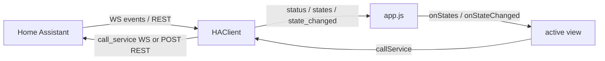

# Architecture

The app is plain ES5 JavaScript with no build step. Scripts load in dependency
order from [`app/index.html`](../app/index.html) and attach small namespaced
objects to `window`.

## Modules

| File | Global | Responsibility |
| ---- | ------ | -------------- |
| `js/config.js` | `HAConfig` | Load/save `{ baseUrl, token }` in `localStorage`; URL + WebSocket URL helpers. |
| `js/xhr.js` | `HAXhr` | Promise wrapper over `mozSystem` `XMLHttpRequest` (REST). |
| `js/ha-client.js` | `HAClient` | Connection layer: WebSocket auth/subscriptions + REST fallback. |
| `js/nav.js` | `HANav` | Key normalization and the `FocusList` D-pad helper. |
| `js/qr.js` | `HAQR` | Camera capture + QR decode for token scanning. |
| `js/vendor/jsQR.js` | `jsQR` | Vendored QR decoder. |
| `js/views/setup.js` | `HAViews.setup` | URL + token entry (and QR scan). |
| `js/views/list.js` | `HAViews.list`, `HAFmt` | Live entity list + shared formatting helpers. |
| `js/views/detail.js` | `HAViews.detail` | Per-entity control view. |
| `js/app.js` | `App` | Routing, softkeys, header/status, toast, client wiring. |

## Controller and views

`app.js` owns the single `HAClient`, the current view, and all chrome
(header title, status pill, softkey bar, toast). It exposes a small `app` object
to views: `go()`, `setTitle()`, `setSoftkeys()`, `toast()`, `getClient()`, etc.

A view is a factory `HAViews.name(app)` returning:

- `render(container, params)` - build the DOM.
- `onKey(key)` - handle a logical key; return `true` if consumed.
- `destroy()` - cleanup.
- optional `onStates()` / `onStateChanged(evt)` - live-data hooks.

Only `app.js` subscribes to the client. It forwards updates to the active view's
`onStates` / `onStateChanged`, so there are no per-view listener leaks.

## Data flow

The client keeps an in-memory `entities` cache (`entity_id -> state`). On a
`state_changed` event it patches the single entity and emits `state_changed`;
`get_states` (or a REST poll) replaces the cache and emits `states`.

## Navigation

`HANav.attach(handler)` installs one global `keydown` listener and normalizes
events to logical keys (`Up`, `Down`, `Left`, `Right`, `Enter`, `SoftLeft`,
`SoftRight`, `Backspace`). `app.js` routes them to the active view. List views
use `HANav.FocusList` to move a `focused` class across rows and scroll the
selection into view.
