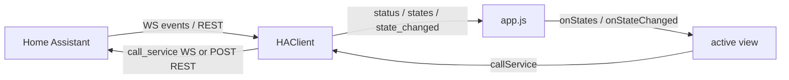
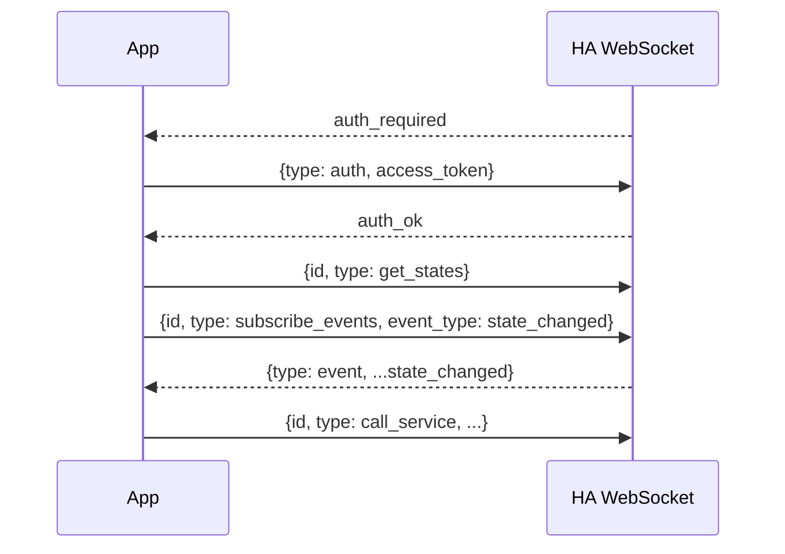

# Architecture

Plain ES5 with no build step. Scripts load in dependency order from
[`app/index.html`](../app/index.html) and attach small namespaced objects to
`window`.

## Modules

| File | Global | Responsibility |
| ---- | ------ | -------------- |
| `js/config.js` | `HAConfig` | Load/save `{ baseUrl, token }` in `localStorage`; URL + WebSocket URL helpers. |
| `js/store.js` | `HAStore` | UI prefs + favorites (separate `localStorage` key). |
| `js/xhr.js` | `HAXhr` | Promise wrapper over `mozSystem` `XMLHttpRequest` (REST). |
| `js/ha-client.js` | `HAClient` | WebSocket auth/subscriptions, registries (areas + devices), REST fallback. |
| `js/icons.js` | `HAIcons` | Inline-SVG glyphs, themed via `currentColor`. |
| `js/format.js` | `HAFmt` | Formatting, badges, capabilities, primary actions, sort comparators. |
| `js/nav.js` | `HANav` | Key normalization and the `FocusList` D-pad helper. |
| `js/qr.js` | `HAQR` | Camera capture + QR decode for token scanning. |
| `js/domains.js` | `HADomains` | Per-domain control builders for the detail screen. |
| `js/components/entitylist.js` | `HAEntityList` | Reusable live list: focus, sort/filter, search, device collapsing, reorder. |
| `js/components/menu.js` | `HAMenu` | Modal list overlay for settings pickers. |
| `js/vendor/jsQR.js` | `jsQR` | Vendored QR decoder. |
| `js/views/*.js` | `HAViews.*` | One factory per screen (setup, home, areas, favorites, all, scenes, automations, device, detail, settings). |
| `js/app.js` | `App` | Back-stack routing, softkeys, header/status, toast, theme, overlay, client wiring. |

## Controller and views

`app.js` owns the single `HAClient`, the current view, and all chrome (title,
status pill, softkey bar, toast), exposing an `app` object to views (`go()`,
`setTitle()`, `setSoftkeys()`, `toast()`, `getClient()`, ...).

A view is a factory `HAViews.name(app)` returning `render(container, params)`,
`onKey(key)` (return `true` if consumed), and `destroy()`, plus optional
live-data hooks (`onStates`, `onStateChanged`, `onRegistries`, `onStatus`) and
`saveState`/`restoreState` for back-stack persistence. Only `app.js` subscribes
to the client and forwards updates to the active view, so there are no per-view
listener leaks. List-style views delegate to the shared `HAEntityList`.

## Navigation

`HANav.attach(handler)` installs one global `keydown` listener and normalizes
events to logical keys (`Up`, `Down`, `Left`, `Right`, `Enter`, `SoftLeft`,
`SoftRight`, `Backspace`, digits `0`-`9`). `app.js` keeps a stack of
`{ name, params, state }`; `go()` pushes (or `replace`/`root`) and `back()`
pops. Home is the root, so Back never exits accidentally, and the last top-level
screen is restored on next launch. An overlay hook lets `HAMenu` intercept keys
while a menu is open; list views use `HANav.FocusList` to move focus across rows.

## Data layer

After `auth_ok`, `HAClient` fetches the area/device/entity registries and keeps
`deviceMeta` + `entityMeta`, resolving each entity's area (directly or via its
device) and refetching (debounced) on `*_registry_updated`. These back the
device-collapsing feature in `HAEntityList`. On REST fallback there are no
registries, so lists stay flat. `HAStore` holds favorites and UI prefs in a
separate `localStorage` key from the credentials.

## Data flow

The client keeps an in-memory `entities` cache (`entity_id -> state`). A
`state_changed` event patches one entity; `get_states` or a REST poll replaces
the cache.

## Home Assistant API

Transport lives in [`ha-client.js`](../app/js/ha-client.js) and
[`xhr.js`](../app/js/xhr.js). The app authenticates with a **long-lived access
token** (HA: Profile -> Security -> Long-Lived Access Tokens), stored only in the
app's private `localStorage` and sent only to the configured host.

### WebSocket (primary)

Endpoint `ws(s)://<host>/api/websocket` (scheme swapped from the base URL).

Each command carries an incrementing `id`; pending ids map to Promise resolvers.
The connection auto-reconnects with exponential backoff (1s up to 30s), and
`auth_invalid` stops retries and returns to setup.

### REST (fallback)

When the socket is down, the client polls `GET /api/states` (~10s) and routes
service calls over HTTP; the status pill shows `rest`.

- `GET /api/` - connection/auth check (setup screen).
- `GET /api/states` - all entity states.
- `POST /api/services/<domain>/<service>` - call a service (body is the service
  data, e.g. `{ "entity_id": "light.kitchen" }`).

### Supported domains

`domains.js` builds per-domain controls: `light` (toggle + brightness),
`switch`/`input_boolean`/`siren` (toggle), `scene`/`script`/`button`
(activate/run/press), `cover`/`fan`/`climate`/`media_player` (open/close, speed,
HVAC mode + target temp, playback/volume), and `number`/`select` (+ `input_*`).
Anything without a builder is shown read-only. HA values are rendered with
`textContent` (never `innerHTML`).
