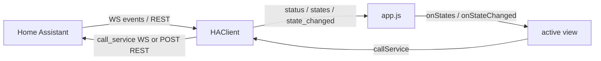

# Architecture

The app is plain ES5 JavaScript with no build step. Scripts load in dependency
order from [`app/index.html`](../app/index.html) and attach small namespaced
objects to `window`.

## Modules

| File | Global | Responsibility |
| ---- | ------ | -------------- |
| `js/config.js` | `HAConfig` | Load/save `{ baseUrl, token }` in `localStorage`; URL + WebSocket URL helpers. |
| `js/store.js` | `HAStore` | Local UI prefs + favorites (separate `localStorage` key). |
| `js/xhr.js` | `HAXhr` | Promise wrapper over `mozSystem` `XMLHttpRequest` (REST). |
| `js/ha-client.js` | `HAClient` | Connection layer: WebSocket auth/subscriptions, **registries**, REST fallback. |
| `js/format.js` | `HAFmt` | Formatting, icons/badges, capabilities, primary actions, sort comparators. |
| `js/nav.js` | `HANav` | Key normalization (incl. digits) and the `FocusList` D-pad helper. |
| `js/qr.js` | `HAQR` | Camera capture + QR decode for token scanning. |
| `js/domains.js` | `HADomains` | Per-domain control builders for the detail screen. |
| `js/components/entitylist.js` | `HAEntityList` | Reusable live list: focus, sort/filter, search, options menu, reorder. |
| `js/components/menu.js` | `HAMenu` | Modal list overlay for option menus and pickers. |
| `js/vendor/jsQR.js` | `jsQR` | Vendored QR decoder. |
| `js/views/setup.js` | `HAViews.setup` | URL + token entry (and QR scan). |
| `js/views/home.js` | `HAViews.home` | Hub: connection card + Favorites/Areas/All/Settings. |
| `js/views/areas.js` | `HAViews.areas`, `HAViews.areaEntities` | Area picker and per-area entity list. |
| `js/views/favorites.js` | `HAViews.favorites` | Favorites dashboard with reorder. |
| `js/views/all.js` | `HAViews.all` | All entities, searchable and grouped. |
| `js/views/detail.js` | `HAViews.detail` | Per-entity control shell (uses `HADomains`). |
| `js/views/settings.js` | `HAViews.settings` | Sort/theme/diagnostics + connection actions. |
| `js/app.js` | `App` | Back-stack routing, softkeys, header/status, toast, theme, overlay, client wiring. |

## Controller and views

`app.js` owns the single `HAClient`, the current view, and all chrome
(header title, status pill, softkey bar, toast). It exposes a small `app` object
to views: `go()`, `setTitle()`, `setSoftkeys()`, `toast()`, `getClient()`, etc.

A view is a factory `HAViews.name(app)` returning:

- `render(container, params)` - build the DOM.
- `onKey(key)` - handle a logical key; return `true` if consumed.
- `destroy()` - cleanup.
- optional `onStates()` / `onStateChanged(evt)` / `onRegistries()` /
  `onStatus(info)` - live-data hooks.

Only `app.js` subscribes to the client. It forwards updates to the active view's
hooks, so there are no per-view listener leaks. List-style views delegate their
work to the shared `HAEntityList` component.

## Navigation and back-stack

`app.js` keeps a stack of `{ name, params }` entries. `go(name, params, opts)`
pushes (or `replace`/`root`), and `back()` pops to the previous screen; Home is
the root, so Back never exits accidentally. The last top-level screen is saved to
`HAStore` and restored on the next launch. An **overlay** hook lets `HAMenu`
intercept keys while a menu is open.

## Data layer (registries + prefs)

After `auth_ok`, `HAClient` also fetches the area, device, and entity registries
(`config/*_registry/list*`), builds an `entity_id -> area` map, emits a
`registries` event, and refetches (debounced) on `*_registry_updated`. On REST
fallback there are no registries, so lists stay flat. `HAStore` holds favorites
and UI preferences (sort mode, theme, diagnostics, last screen) in a separate
`localStorage` key from the credentials.

## Data flow

The client keeps an in-memory `entities` cache (`entity_id -> state`). On a
`state_changed` event it patches the single entity and emits `state_changed`;
`get_states` (or a REST poll) replaces the cache and emits `states`.

## Navigation

`HANav.attach(handler)` installs one global `keydown` listener and normalizes
events to logical keys (`Up`, `Down`, `Left`, `Right`, `Enter`, `SoftLeft`,
`SoftRight`, `Backspace`, and digit keys `0`-`9`). `app.js` routes them to the
overlay (if any) or the active view. List views use `HANav.FocusList` to move a
`focused` class across rows and scroll the selection into view.
