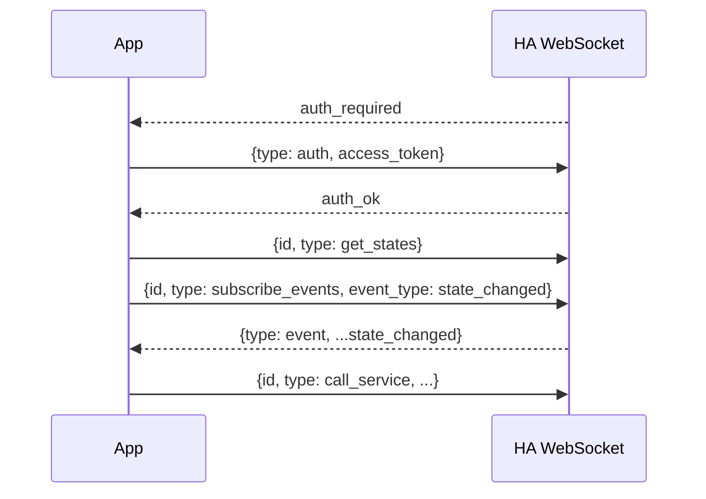

# Home Assistant API

The app authenticates with a **long-lived access token** and prefers the
WebSocket API, falling back to REST. All transport lives in
[`app/js/ha-client.js`](../app/js/ha-client.js) and
[`app/js/xhr.js`](../app/js/xhr.js).

## Authentication

Create a token in Home Assistant: **Profile -> Security -> Long-Lived Access
Tokens -> Create Token**. The dialog also shows a QR code of the token, which the
app can scan (see [QR token scanning](qr-scanning.md)).

- REST requests send `Authorization: Bearer <token>`.
- The WebSocket sends the token in its `auth` message.

The token is stored only in the app's private `localStorage` and is sent only to
the configured host.

## WebSocket (primary)

Endpoint: `ws(s)://<host>:8123/api/websocket` (derived from the base URL by
swapping the scheme).

Each command carries an incrementing `id`; pending ids map to Promise resolvers.
On `state_changed` the client patches its entity cache. The connection
auto-reconnects with exponential backoff (1s up to 30s). An `auth_invalid`
response stops retries and returns the user to setup.

## REST (fallback)

When the socket is down, the client polls `GET /api/states` every ~10s and
routes service calls over HTTP:

- `GET /api/` - connection/auth check (used by the setup screen).
- `GET /api/states` - all entity states.
- `POST /api/services/<domain>/<service>` - call a service; body is the service
  data (e.g. `{ "entity_id": "light.kitchen" }`).

The header status pill shows `rest` while the fallback is active.

## Supported domains

The list view groups entities and the detail view offers controls for:

- `light` - toggle, brightness (`light.turn_on` with `brightness_pct`).
- `switch` / `input_boolean` - toggle.
- `scene` - activate (`scene.turn_on`).
- `climate` - HVAC mode (`climate.set_hvac_mode`) and target temperature
  (`climate.set_temperature`).
- `sensor` / `binary_sensor` - read-only.

All other domains are listed read-only with their full attribute set.

## Security note

Values received from Home Assistant are rendered with `textContent` (never
`innerHTML`) so entity/attribute strings cannot inject markup or script.
