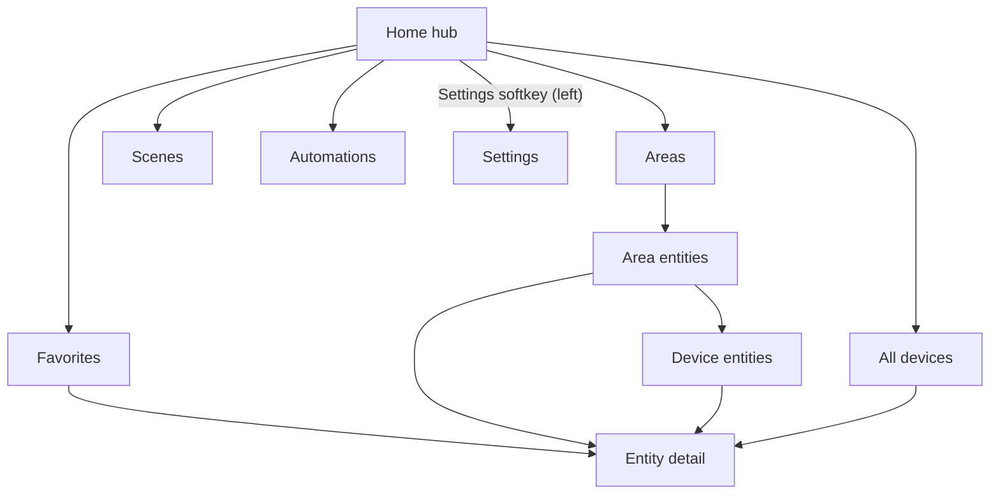

# UI guide

Built for a ~240x320 non-touch screen driven by a D-pad and three softkeys.
Navigation is a back-stack: **Back** returns to the previous screen and **Home**
is the root (Back there does nothing). The last top-level screen is restored on
next launch.

## Controls

| Key            | List view                          | Detail view                    |
| -------------- | ---------------------------------- | ------------------------------ |
| Up / Down      | Move selection (or search)         | Move between controls          |
| Left / Right   | -                                  | Adjust value (brightness/temp) |
| Center / Enter | Primary action (toggle / open)     | Activate focused control       |
| 1-9            | Jump to the nth row                | -                              |
| Left softkey   | `Back`                             | `Back`                         |
| Right softkey  | `Details` (`Reorder` on Favorites) | `Fav` / `Unfav`                |

## Screens

- **Home** - connection/last-updated card plus Favorites, Areas, Scenes,
  Automations, and All devices. Left softkey opens Settings; when offline the
  right softkey is `Reconnect`.
- **Areas** - HA areas (plus `Unassigned`), each split into Scenes, Automations,
  and Entities. Requires WebSocket; on REST fallback the All screen groups by
  domain instead.
- **All devices** - every entity, grouped by area (or domain), with search.
- **Scenes / Automations** - dedicated lists so activating one is a step from
  Home.
- **Detail** - per-entity controls; right softkey toggles favorite.

Every row shows an inline-SVG domain glyph (e.g. a bulb for lights) in place of a
text badge.

## Lists and device grouping

All lists (Favorites, Scenes, Automations, Area/Device entities, All) share one
component using the keys above. When HA registries are available, entities of the
same device collapse into a single device row (name, count, `>` chevron) that
drills into a sub-screen; single-entity and device-less entities stay as normal
rows. Collapsing applies to Areas, All devices, and Favorites, and is suppressed
while searching or reordering.

## Search, sorting, favorites, themes

- **Search** (All devices): from the top row press Up to focus the search box;
  type to filter by name or entity id; Down/Enter returns to the list, right
  softkey (`Clear`) resets.
- **Sort** (Settings -> Sort order): **Smart** (default: controllable first,
  then active, then domain priority, then name), **Name**, or **Status**. Hidden
  and (unless Show diagnostics is on) diagnostic entities are omitted.
- **Favorites**: add/remove from the detail screen's right softkey; reorder from
  the Favorites list (`Reorder`, then Up/Down, Done). Stored locally in
  `localStorage`, independent of HA.
- **Themes**: Dark / Light in Settings; remembered.

## Token QR scan

In setup, select **Scan token QR**: the camera opens, frames are decoded a few
times per second, and on a hit the token fills the field and focus moves to
**Connect**. A softkey or Backspace cancels. Camera/permission details are in
[Platform](platform.md#camera).

## Visual style

Follows the [KaiOS design guide](https://developer.kaiostech.com/docs/design-guide/ui-component):
Open Sans type scale (17/14/12px), 60px list items, centered header, standard
softkey bar, HA-blue focus highlight. Sizes are fixed px (rem is avoided because
on-device font inflation can rebase it; `text-size-adjust` disables auto-inflation).
All colors are CSS variables in [app/css/app.css](../app/css/app.css), so themes
are just variable overrides.
