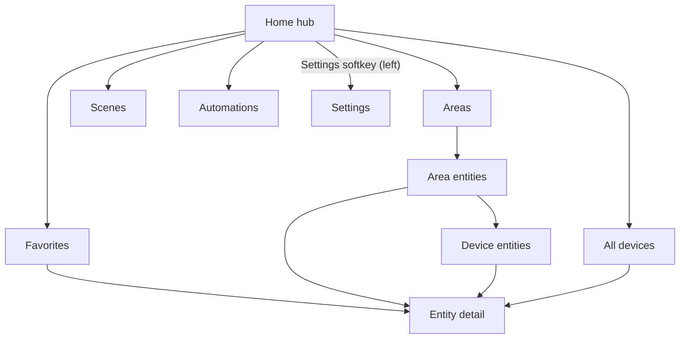

# UI guide

The app is built for a ~240x320 non-touch screen driven by a D-pad and three
softkeys. Navigation uses a back-stack: **Back** returns to the previous screen,
and **Home** is the root (Back there does nothing, so you never exit by
accident). The last top-level screen you visited is restored on the next launch.

## Controls

| Key            | List view                          | Detail view                    |
| -------------- | ---------------------------------- | ------------------------------ |
| Up / Down      | Move selection (or search)         | Move between controls          |
| Left / Right   | -                                  | Adjust value (brightness/temp) |
| Center / Enter | Primary action (toggle / open)     | Activate focused control       |
| 1-9            | Jump to the nth row                | -                              |
| Left softkey   | `Back`                             | `Back`                         |
| Right softkey  | `Details` (`Reorder` on Favorites) | `Fav` / `Unfav`                |

## Screens

- **Home** - a connection/last-updated card plus logically grouped entries:
  Favorites, Areas, Scenes, Automations, and All devices. The left softkey opens
  **Settings**; when offline, the right softkey is `Reconnect`.
- **Favorites** - your local dashboard. Reorder via the right softkey
  (`Reorder`), then Up/Down to move and Done to finish.
- **Scenes** / **Automations** - dedicated lists of just your scenes and
  automations, so the common "activate a scene / run an automation" flow is one
  step from Home.
- **Areas** - areas from Home Assistant (plus `Unassigned`), each opening its
  entity list split into `Scenes`, `Automations`, and `Entities` sections. Areas
  require the WebSocket connection; on REST fallback the All screen groups by
  domain instead.
- **All devices** - every entity, grouped by area (or domain), with search.
- **Detail** - per-entity controls; the right softkey toggles favorite.

Every row shows a small purpose glyph (an inline SVG icon reflecting the domain,
e.g. a bulb for lights or a lock for locks) in place of a text badge.

## Device grouping

When Home Assistant registries are available, entities that belong to the same
device (for example the five entities of an "Entry Door Lock") collapse into a
single device row showing the device name, an entity count, and a `>` chevron.
Selecting it drills into a sub-screen listing just that device's entities.
Devices with only one visible entity, and entities with no device, appear as
normal rows. Collapsing applies to Areas, All devices, and Favorites, and is
automatically suppressed while searching or reordering so those operate on
individual entities.

## Lists

Every list (Favorites, Scenes, Automations, Area entities, Device entities, All)
shares one component with the keys in [Controls](#controls) above.

The right softkey opens the focused entity's **Details** screen. On the
Favorites list it instead reads `Reorder` and enters reorder mode. A collapsed
device row has no Details, so the right softkey is blank there; Center / Enter
opens the device's entity sub-screen. Add or remove favorites from the Details
screen's right softkey (`Fav` / `Unfav`).

## Search (All devices)

From the top row press **Up** to focus the search box; type to filter by name or
entity id. Press **Down** or **Enter** to return to the list, or the right
softkey (`Clear`) to reset.

## Sorting and filtering

Set the sort mode in **Settings -> Sort order**:

- **Smart** (default) - controllable entities first, then active/on, then a
  domain priority, then name.
- **Name** - alphabetical.
- **Status** - active/on first, then name.

Hidden entities and, unless **Show diagnostics** is enabled, config/diagnostic
entities are omitted from smart/sorted lists.

## Favorites

Add or remove favorites from the detail screen's right softkey (`Fav` /
`Unfav`). Favorites are stored locally on the device (in `localStorage`),
independent of Home Assistant, and keep the order you set.

## Themes

Switch between **Dark** and **Light** in Settings; the choice is remembered.

## Visual style

The styling follows the [KaiOS design guide](https://developer.kaiostech.com/docs/design-guide/ui-component)
and KaiUI conventions: the Open Sans type scale (primary 17px / secondary 14px /
tertiary 12px), 60px list items, a centered uppercase header, and the standard
light-gray softkey bar (left/right Title Case, center ALL CAPS). Selection uses
the Home Assistant blue accent as the focus highlight. Sizes are fixed px (the
KaiOS spec is defined in rem against a 10px root, but on-device Gecko font
inflation can rebase rem and blow up the layout, so px keeps it deterministic;
text auto-inflation is disabled via `text-size-adjust`). All colors are CSS
variables in [app/css/app.css](../app/css/app.css), so the dark (default) and
light themes are just variable overrides.
