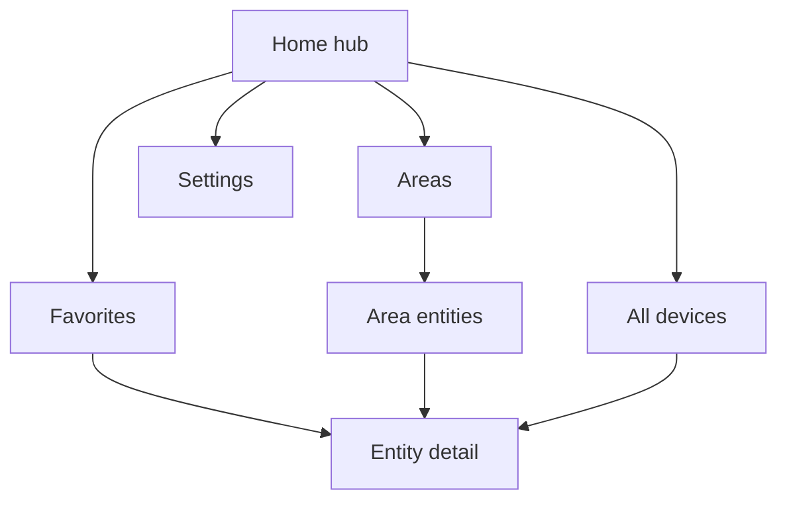

# UI guide

The app is built for a ~240x320 non-touch screen driven by a D-pad and three
softkeys. Navigation uses a back-stack: **Back** returns to the previous screen,
and **Home** is the root (Back there does nothing, so you never exit by
accident). The last top-level screen you visited is restored on the next launch.

## Screens

- **Home** - a connection/last-updated card plus Favorites, Areas, All devices,
  and Settings. When offline, the left softkey is `Reconnect`.
- **Favorites** - your local dashboard. Reorder via the options menu
  (`Options -> Reorder list`), then Up/Down to move and Done to finish.
- **Areas** - areas from Home Assistant (plus `Unassigned`), each opening its
  entity list. Areas require the WebSocket connection; on REST fallback the All
  screen groups by domain instead.
- **All devices** - every entity, grouped by area (or domain), with search.
- **Detail** - per-entity controls; the right softkey toggles favorite.

## Lists

Every list (Favorites, Area entities, All) shares one component:

| Key            | Action                                         |
| -------------- | ---------------------------------------------- |
| Up / Down      | Move selection                                 |
| Center / Enter | Primary action (toggle / activate / open)      |
| 1-9            | Jump to the nth row                            |
| Left softkey   | `Back`                                         |
| Right softkey  | `Options`                                      |

The **options menu** offers the primary action, Details, Add/Remove favorite,
and Go to area (when the entity has one).

## Search (All devices)

From the top row press **Up** to focus the search box; type to filter by name or
entity id. Press **Down** or **Enter** to return to the list, or the right
softkey (`Clear`) to reset.

## Sorting and filtering

Set the sort mode in **Settings -> Sort order**:

- **Smart** (default) - controllable entities first, then active/on, then a
  domain priority, then name.
- **Name** - alphabetical.
- **Status** - active/on first, then name.

Hidden entities and, unless **Show diagnostics** is enabled, config/diagnostic
entities are omitted from smart/sorted lists.

## Favorites

Add or remove favorites from any list's options menu or the detail screen's
right softkey. Favorites are stored locally on the device (in `localStorage`),
independent of Home Assistant, and keep the order you set.

## Themes

Switch between **Dark** and **Light** in Settings; the choice is remembered.
